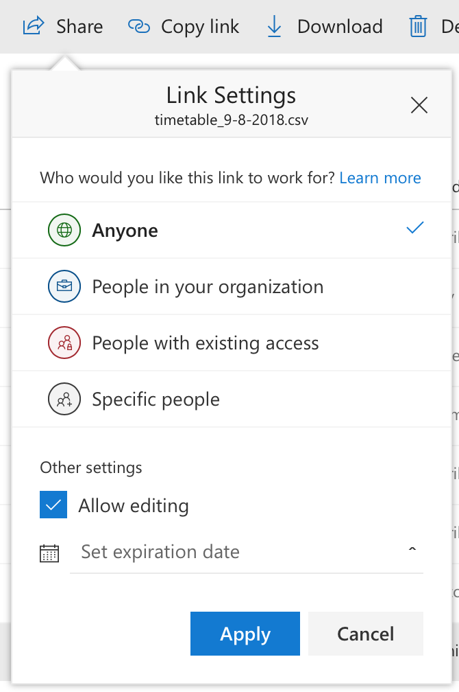

```{r setup, include=FALSE}
library(tidyverse)
```


## Data which is not sensitive and for which you can create a 'public' URL

Reading data directly from office 365 is possible.


1. Create a csv file in O365
2. Get a 'shareable link' (see screenshot). Make sure this can be viewed by 'anyone' (so don't use for sensitive data)
3. Add `&download=1` to the end of the URL created for you, and use this in `readr::read_csv`. See example below:





```{r}
ttdata <- read_csv('https://liveplymouthac-my.sharepoint.com/:x:/g/personal/ben_whalley_plymouth_ac_uk/EVDlZFp7S_1DgbRq6kNhGqsBlsHP_1ReFyMuIaZCujvCMw?e=xy0rQj&download=1')
ttdata %>% glimpse()
```